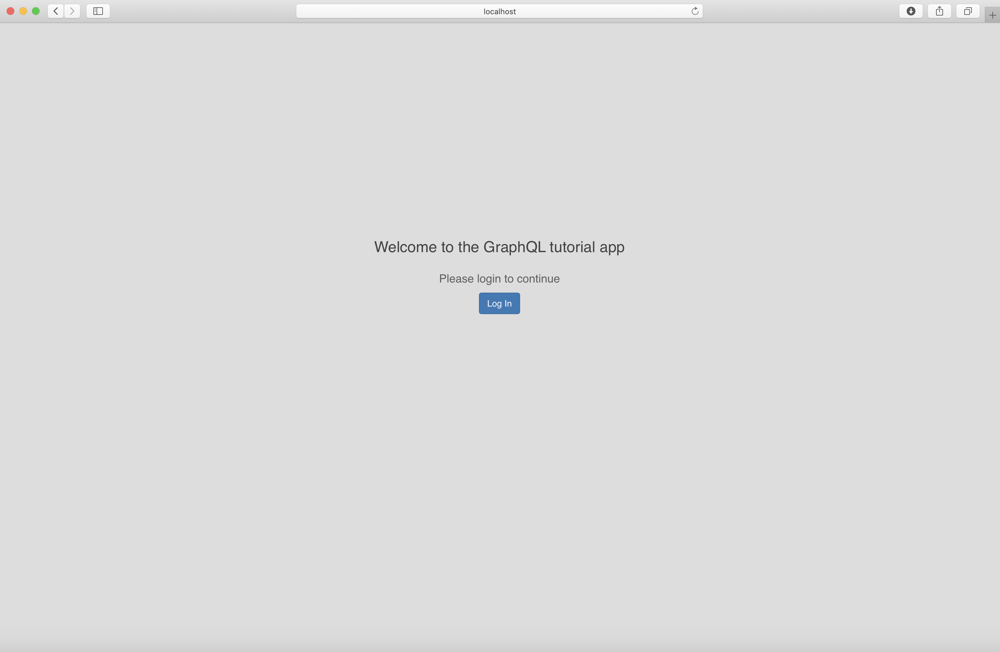
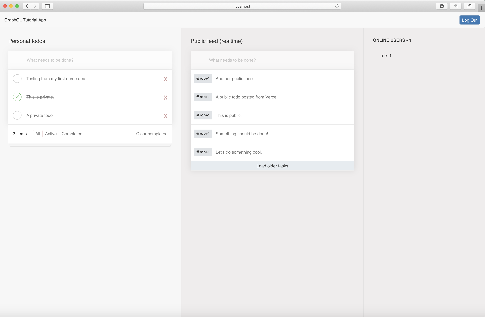

After taking the [tutorial](https://hasura.io/learn/graphql/nextjs-fullstack-serverless) for working with [Hasura](https://hasura.io/), [Auth0](https://auth0.com), [Apollo](https://www.apollographql.com), [Next.js](https://nextjs.org), and [Vercel](https://vercel.com/), I wanted to create a separate project for my own personal refinements and enhancements.

This project is using the app I created in [https://github.com/TheRobBrennan/explore-hasura-apollo-nextjs](https://github.com/TheRobBrennan/explore-hasura-apollo-nextjs) - which is using the [Hasura](https://hasura.io/) server I have configured on [Heroku](https://www.heroku.com/) and connected to my [Auth0](https://auth0.com) tenant.






# Getting started

## Prerequisites

This project assumes you have already configured and deployed a [Hasura back-end](https://github.com/TheRobBrennan/explore-hasura-apollo-nextjs#hasura-backend-setup) to a publicly available URL, as well as [configured Auth0](https://github.com/TheRobBrennan/explore-hasura-apollo-nextjs#auth0-setup) to [connect to your Hasura setup](https://github.com/TheRobBrennan/explore-hasura-apollo-nextjs#connect-hasura-with-auth0).

## Our app

Our [Next.js](https://nextjs.org) application requires you to define several environment variables before it runs.

Please copy `app/.env.example` to `app/.env` and make sure you have defined all the values requested:

```sh
# Application settings
DOMAIN=http://localhost:3000
SESSION_COOKIE_SECRET=BXyv4qDtBKYxJtLopfY7nj75sJg3p2Ka

# Auth0 API
AUTH0_AUDIENCE=

# Auth0 Application
AUTH0_CLIENT_ID=
AUTH0_CLIENT_SECRET=
AUTH0_DOMAIN=
POST_LOGOUT_REDIRECT_URI=http://localhost:3000/
REDIRECT_URI=http://localhost:3000/api/callback
```

### Start the application

To run the [Next.js](https://nextjs.org), be sure to navigate to the `app` directory, install all of the dependencies, and then run the app:

```sh
$ cd app
$ npm install

# To run Next.js in development mode
$ npm run dev

# To run Next.js as a production server
$ npm start
```

If you have defined your environment variables correctly, your app should be running at [http://localhost:3000](http://localhost:3000) - allowing you to log in and log out using [Auth0](https://auth0.com) for authentication.

**PRO TIP** Once you have installed your dependencies, you can simply run `npm start` from the root level of this project.
